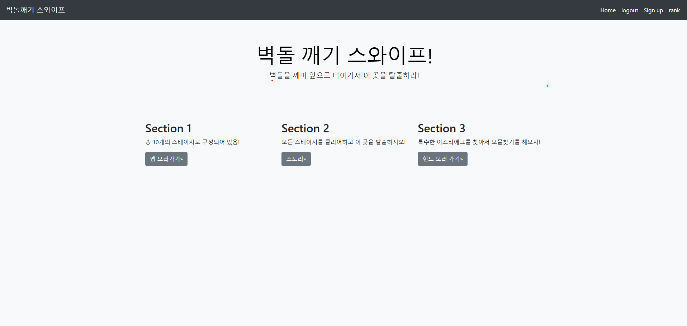
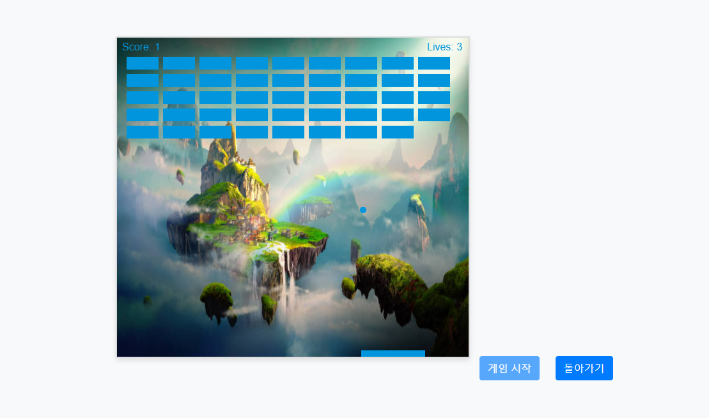

   
  <h1>벽돌깨기</h1>
   

## 목차

1. **프로젝트 소개**
2. **기술 스택**
3. **주요 기능**
4. **주요 페이지**

 

## 💁🏻‍♂ 프로젝트 소개

&nbsp;&nbsp;마우스를 이용해 판을 움직이며 공을 튕겨서 벽돌을 깨는 게임입니다.

 

## 🛠 기술 스택

**Front-end**

- 
- 

**Back-end**
- 

 

## 💡 주요 기능

- 스테이지를 밀며 게임을 진행
- 회원가입정보를 DB에 입력하여 스테이지 현황을 지속할 수 있게 만듬
- 이스터에그 맵을 숨겨둠

 

## 📄 주요 페이지

|                               메인 페이지                               |                               서브 페이지                               |
| :---------------------------------------------------------------------: | :---------------------------------------------------------------------: |
|  |  |

 
